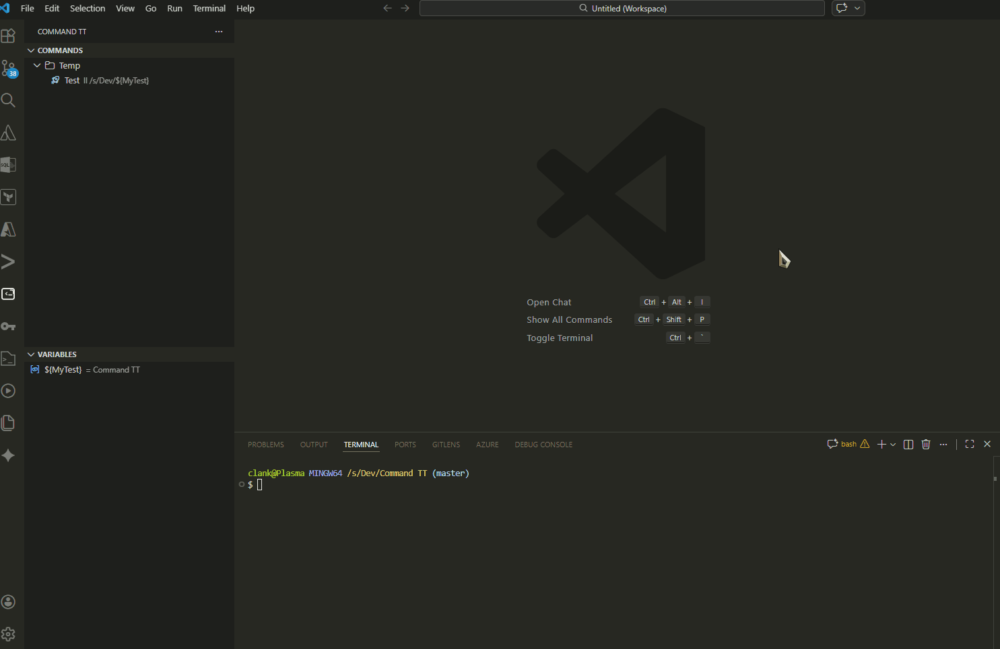

# Command TT

Send terminal commands with variables from two dedicated panels in VS Code.

## Features

- Commands panel (shown above Variables) with grouped and nested groups (use /)
- Variables panel to manage named values like ${server} or ${host}
- Run commands by clicking a command item
- Inline actions to run, edit, and remove items
- Variable substitution inside commands (ping ${host})
- Friendly error when a variable is missing
- Per-command icon and per-command iconColor, plus a global default icon color
- Optional Enter key sending controlled per command
- Refresh buttons for Commands and Variables
- All data stored in user settings JSON

## GIFs

Shows commands panel, grouping, and nested groups (use /).


Run a command by clicking it and see it sent to the terminal.
Create and edit variables used in ${var} substitution.
Shows the friendly error when a variable is missing.
Refresh Commands and Variables views.

## Usage

### Quick Start

1. Open the **Command TT** activity bar icon.
2. Add variables in the **Variables panel** (managed via command palette or UI).
3. Add commands in the **Commands panel**.
4. Click a command to run it in the terminal.

### Commands

- Click a command item to run it.
- Use `/` in group names to create nested subgroups (example: `Ops/Deploy/Staging`).
- Commands can reference variables using `${variableName}` syntax.
- Inline actions: hover over a command to see edit and delete buttons.

### Variables

Variables are reusable values that you define once and use in multiple commands.

#### Simple Variables
A simple variable has a fixed value:

```json
{
  "name": "host",
  "value": "192.168.1.1",
  "description": "Main server IP address"
}
```

Use in commands: `ping ${host}` or `ssh user@${host}`

#### Select Variables (with Options)
A select variable lets you choose from multiple predefined options. When you execute a command containing a select variable, a **Quick Pick dialog** appears asking you to select a value.

```json
{
  "name": "action",
  "value": "start",
  "options": ["start", "stop", "restart"],
  "description": "Service action"
}
```

When running a command that includes `${action}`, you'll see a dialog to choose which option to use.

#### Multiple Variables in One Command
If a command contains multiple variables with options (or a mix of simple and select variables), you'll be prompted for each one in order:

```json
{
  "title": "Deploy Service",
  "command": "docker ${action} ${service}",
  "group": "Ops/Deploy"
}
```

With variables `action: [start, stop, restart]` and `service: [web, api, db]`, executing this command will:
1. Show Quick Pick for `action` → select value
2. Show Quick Pick for `service` → select value
3. Run the final command (e.g., `docker start web`)

## Extension Settings

- `commandTT.sortOrder`: Display order for variables and commands (`"settings"` or `"alphabetical"`). Default: `"settings"` (respects order in settings.json).
- `commandTT.commandIconColor`: Theme color id for command icons (default: `terminal.ansiCyan`).
- `commandTT.variables`: Array of variable definitions (see [Data Format](#data-format)).
- `commandTT.commands`: Array of command definitions (see [Data Format](#data-format)).

## Data Format

### Variable Definition

```json
{
  "name": "variableName",
  "value": "defaultValue",
  "description": "Optional description (shown in tooltip)",
  "options": ["optional", "list", "of", "values"]
}
```

**Fields:**
- `name` (required): Variable identifier used as `${name}` in commands.
- `value` (required): Default value or first option if `options` is provided.
- `description` (optional): Shown in the Variables panel tooltip.
- `options` (optional): Array of selectable values. If present, creates a select variable that prompts on execute.

### Command Definition

```json
{
  "title": "Command Display Name",
  "command": "actual command text with ${variables}",
  "group": "Optional/Group/Path",
  "description": "Optional description",
  "icon": "codicon-name",
  "iconColor": "theme.color",
  "sendNewLine": true
}
```

**Fields:**
- `title` (required): Display name in the Commands panel.
- `command` (required): Actual command text; supports `${variableName}` substitution.
- `group` (optional): Grouping path using `/` for hierarchy (e.g., `Ops/Network/Monitoring`).
- `description` (optional): Shown in the command tooltip.
- `icon` (optional): VS Code codicon name (e.g., `terminal`, `rocket`, `cloud`).
- `iconColor` (optional): Override global icon color with a theme color id.
- `sendNewLine` (optional): Send Enter key after the command (default: `true`).

## Complete Example

Add to your VS Code user **settings.json**:

```json
"commandTT.variables": [
  {
    "name": "env",
    "value": "dev",
    "options": ["dev", "staging", "prod"],
    "description": "Deployment environment"
  },
  {
    "name": "service",
    "value": "web",
    "options": ["web", "api", "db"],
    "description": "Docker service name"
  },
  {
    "name": "host",
    "value": "localhost",
    "description": "Target host"
  }
],
"commandTT.commands": [
  {
    "title": "Docker Compose",
    "command": "docker compose -f docker-compose.${env}.yml up ${service}",
    "group": "Docker",
    "icon": "terminal",
    "iconColor": "terminal.ansiBlue"
  },
  {
    "title": "SSH Connect",
    "command": "ssh ${host}",
    "group": "Network",
    "icon": "cloud"
  }
],
"commandTT.sortOrder": "settings"
```
