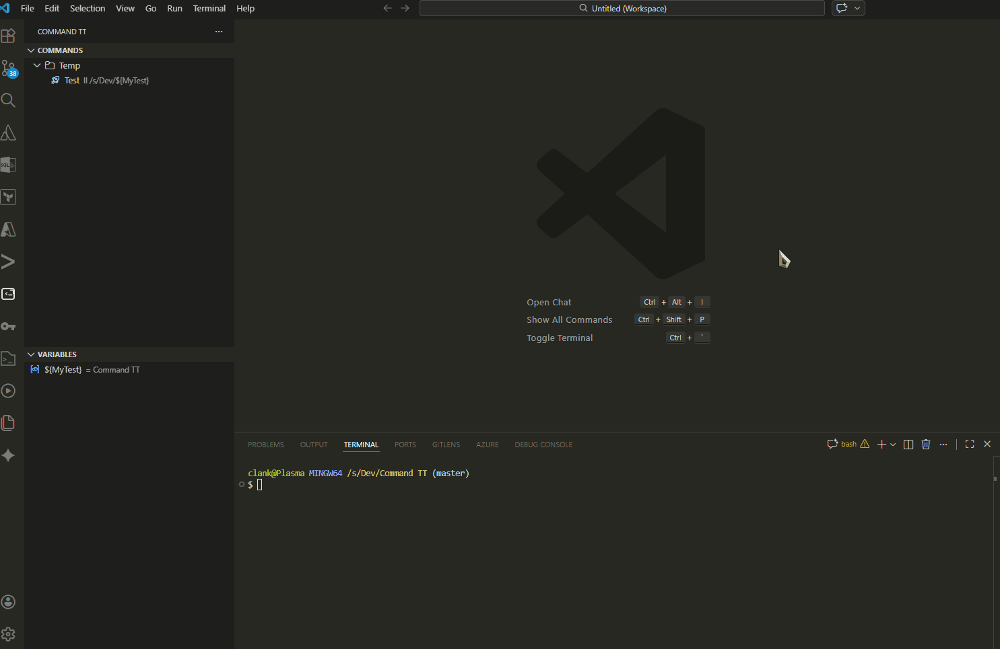

# Command TT

Send terminal commands with variables from two dedicated panels in VS Code.

## Features

- Commands panel (shown above Variables) with nested folders using the `group` path
- Variables panel with inline editing for `text`, `select`, `checkbox`, `date`, and `datetime`
- Search in both the Variables and Commands views
- Grouping is driven directly by each item's `group` field — no separate folder setting is needed
- Run commands by clicking a command item
- Inline actions to run, edit, remove, and organize items
- Variable substitution inside commands such as `ping ${host}`
- Friendly error when a variable is missing
- Per-command `icon` / `iconColor`, plus a global default icon color
- Optional Enter key sending controlled per command
- Refresh buttons for Commands and Variables
- All data is stored in user settings JSON

## GIFs

Shows commands panel, grouping, and nested groups (use /).


Run a command by clicking it and see it sent to the terminal.
Create and edit variables used in ${var} substitution.
Shows the friendly error when a variable is missing.
Refresh Commands and Variables views.

## Usage

### Quick Start

1. Open the **Command TT** activity bar icon.
2. Add variables in the **Variables panel** (managed via command palette or UI).
3. Add commands in the **Commands panel**.
4. Click a command to run it in the terminal.

### Commands

- Click a command item to run it.
- Use `/` in group names to create nested subgroups (example: `Ops/Deploy/Staging`).
- Commands can reference variables using `${variableName}` syntax.
- Inline actions: hover over a command to see edit and delete buttons.

### Variables

Variables are reusable values that you define once and use in multiple commands.

- Edit variable names and values directly in the Variables panel.
- The `${` and `}` tokens are fixed in the UI, so you only type the variable name.
- Use the folder buttons in the Variables panel or the `group` field to organize nested folders.
- There is **no separate `commandTT.variableFolders` setting**; folders come from each variable's `group` path.
- Use the pencil icon for advanced editing when you need to change the type, options, or group.

#### Simple Variable
```json
{
  "name": "host",
  "value": "192.168.1.1",
  "type": "text"
}
```

Use in commands: `ping ${host}` or `ssh user@${host}`

#### Variable Types
- `text`: free text input
- `select`: dropdown built from `options`
- `checkbox`: two options used as off/on values
- `date`: native date picker
- `datetime`: native date-time picker

Example select variable:

```json
{
  "name": "action",
  "value": "start",
  "type": "select",
  "options": ["start", "stop", "restart"],
  "group": "Ops/Deploy"
}
```

#### Multiple Variables in One Command
Commands always use the **current values already set in the Variables panel**.

```json
{
  "title": "Deploy Service",
  "command": "docker ${action} ${service}",
  "group": "Ops/Deploy"
}
```

If `action` is `start` and `service` is `web`, the command runs as:

```sh
docker start web
```

## Extension Settings

### Main settings you maintain
- `commandTT.variables`: Array of variable definitions.
- `commandTT.commands`: Array of command definitions.

### Optional display settings
- `commandTT.sortOrder`: Display order for variables and commands (`"settings"` or `"alphabetical"`). Default: `"settings"`.
- `commandTT.commandIconColor`: Theme color id for command icons (default: `terminal.ansiCyan`).

## Data Format

### Variable Definition

```json
{
  "name": "variableName",
  "value": "defaultValue",
  "type": "text",
  "options": ["optional", "list", "of", "values"],
  "group": "Optional/Group/Path"
}
```

**Fields:**
- `name` (required): Variable identifier used as `${name}` in commands.
- `value` (required): Current/default value stored for the variable.
- `type` (optional): One of `text`, `select`, `checkbox`, `date`, or `datetime`.
- `options` (optional): Used by `select` and `checkbox` variables.
- `group` (optional): Folder path using `/` for hierarchy.

> Folders and subfolders are derived from `group`. There is no separate folders array in settings.

### Command Definition

```json
{
  "title": "Command Display Name",
  "command": "actual command text with ${variables}",
  "group": "Optional/Group/Path",
  "description": "Optional description",
  "icon": "codicon-name",
  "iconColor": "theme.color",
  "sendNewLine": true
}
```

**Fields:**
- `title` (required): Display name in the Commands panel.
- `command` (required): Actual command text; supports `${variableName}` substitution.
- `group` (optional): Grouping path using `/` for hierarchy (e.g., `Ops/Network/Monitoring`).
- `description` (optional): Shown in the command tooltip.
- `icon` (optional): VS Code codicon name (e.g., `terminal`, `rocket`, `cloud`).
- `iconColor` (optional): Override global icon color with a theme color id.
- `sendNewLine` (optional): Send Enter key after the command (default: `true`).

## Complete Example

Add to your VS Code user **settings.json**:

> Keep your data in `commandTT.variables` and `commandTT.commands`. Use `group` inside each item to create folders and subfolders.

```json
"commandTT.variables": [
  {
    "name": "env",
    "value": "dev",
    "type": "select",
    "options": ["dev", "staging", "prod"],
    "group": "Docker"
  },
  {
    "name": "service",
    "value": "web",
    "type": "select",
    "options": ["web", "api", "db"],
    "group": "Docker"
  },
  {
    "name": "dryRun",
    "value": "false",
    "type": "checkbox",
    "options": ["false", "true"],
    "group": "Docker"
  },
  {
    "name": "host",
    "value": "localhost",
    "type": "text",
    "group": "Network"
  }
],
"commandTT.commands": [
  {
    "title": "Docker Compose",
    "command": "docker compose -f docker-compose.${env}.yml up ${service}",
    "group": "Docker",
    "icon": "terminal",
    "iconColor": "terminal.ansiBlue"
  },
  {
    "title": "SSH Connect",
    "command": "ssh ${host}",
    "group": "Network",
    "icon": "cloud"
  }
]
```
